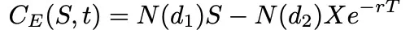
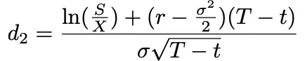

# Black-Scholes Model

Notes from here : https://www.cantorsparadise.com/the-black-scholes-formula-explained-9e05b7865d8a

### Assumptions

- **Market Efficiency**: perfectly efficient market, where no arbitrage opportunities exist
- **Continuous Trading**: no transaction costs or restrictions on short selling
- **Log-Normal Distribution**: The model assumes that the logarithmic returns of the underlying asset follow a log-normal distribution
- **Risk-Neutral Valuation:** expected return on the underlying asset is equal to the risk-free rate

### Inputs/Key Components

a. Underlying Asset Price (S)

b. Strike Price (K)

c. Time to Expiration (T)

d. Risk-Free Interest Rate (r)

e. Implied Volatility (σ): The estimated future volatility of the underlying asset’s returns, derived from the market prices of options.

f. The function N(・) represents the cumulative distribution function for a normal (Gaussian) distribution and may be thought of as ‘the probability that a random variable is less or equal to its input (i.e. d₁ and d₂) for a normal distribution’.  the of value N(・) will always be between 0 ≤ N(・) ≤ 1. 

g. The inputs d₁ and d₂ are given by:

Very informally, the two terms in the sum given by the Black-Scholes formula may be thought of as ‘the current price of the stock weighted by the probability that you will exercise your option to buy the stock’ minus ‘the discounted price of exercising the option weighted by the probability that you will exercise the option’, or simply ‘what you are going to get’ minus ‘what you are going to pay’ 

### Used for 
a. Calcualting Call and Put Values: The model generates the fair values of both call and put options

b. Option Sensitivities (Greeks): The Black-Scholes model facilitates the calculation of option sensitivities - delta, gamma, theta, vega, and rho, which measure the option’s sensitivity to changes in underlying asset price, implied volatility, time decay, and other factors.

c. Implied Volatility: By inputting the option’s market price and using the Black-Scholes formula, traders can reverse engineer the implied volatility, which represents the market’s expectation of future price volatility.

### Limitations
a. European-Style Options:  It may not accurately price American-style options, which can be exercised at any time before expiration.

b. Constant Volatility: constant volatility throughout the option’s life, which may not reflect real-world dynamics.

c. Market Frictions: The model assumes frictionless markets, disregarding factors like transaction costs, bid-ask spreads, and liquidity constraints.

d. Dividends: The Black-Scholes model does not explicitly account for dividend payments on the underlying asset. Adjustments may be necessary for options on dividend-paying stocks.\

ie - \

* The underestimation of extreme moves in the stock, yielding tail risk
* The assumption of instant, cost-less trading, yielding liquidity risk
* The assumption of a stationary process, yielding volatility risk
* The assumption of continuous time and trading, yielding gap risk