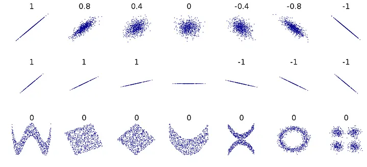
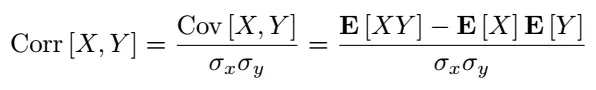
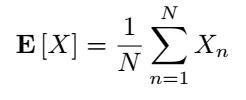
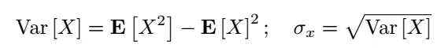
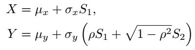
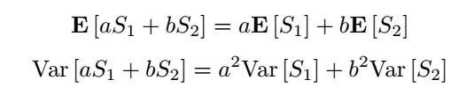
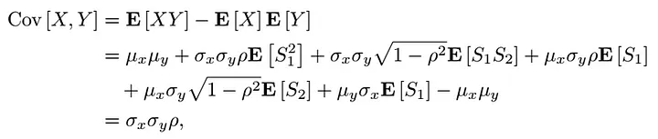
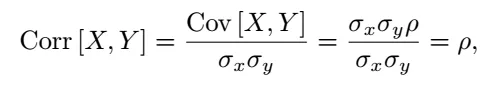

# Simulating Correlated Random Variables in Python
https://oscarnieves100.medium.com/simulating-correlated-random-variables-in-python-c3947f2dbb10

Different datasets and their correlations - described by ρ 

Let S1 and S2 be standard normal random variables (each with mean 0 and variance 1) sampled from a normal distribution. 
Because we are sampling them independently of one another, they are by default uncorrelated. 
We will test this out in Python by calculating the correlation coefficient. 
Remember, we define correlation as follows:

E[X] is defined as:

variance and standard deviations of some variable X as:

mpute two correlated variables X and Y with coefficient ρ (defined by us). 
To do this, we can use the following transformation:

 properties of normal random variables, namely:

which is true when S1 and S2 are statistically independent (uncorrelated). Next, using our previous definition of the correlation and the fact that S1 and S2 both have mean zero and variance 1:

therefore:

which completes our proof. 

