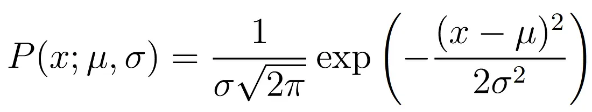
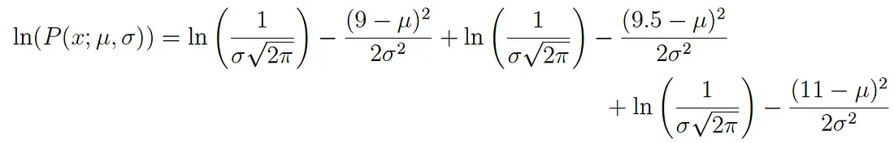
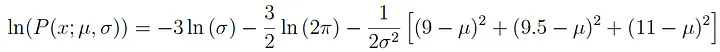

**Maximum likelihood estimation** \

notes from : https://towardsdatascience.com/probability-concepts-explained-maximum-likelihood-estimation-c7b4342fdbb1

Maximum likelihood estimation is a method that determines values for the parameters of a model. The parameter values are found such that they maximise the likelihood that the process described by the model produced the data that were actually observed.

Steps : \
For a set of observed data
- assume a model based on experience eg if model is gaussian - parameters μ(mean) and σ(std dev)
- We use MLE to calcualte the maximum likelihood estimates of the parameter values of the Gaussian distribution μ and σ
- Note : If the events (i.e. the process that generates the data) are independent, then the total probability of observing all of data is the product of observing each data point individually (i.e. the product of the marginal probabilities).
- The probability density of observing a single data point x, that is generated from a Gaussian distribution is given by:

- We have to do is find the derivative of the function, set the derivative function to zero and then rearrange the equation to make the parameter of interest the subject of the equation. And  we’ll have our MLE values for our parameters.

- To simplify the derivative process - we calculate the log liklihood - since this is a monotonically increasing function it ensures that the maximum value of the log of the probability occurs at the same point as the original probability function

- consider we have 3 points - 9, 9.5 and 11

- Taking logs of the original expression gives us:

- This expression can be simplified again using the laws of logarithms to obtain:

T- his expression can be differentiated to find the maximum. In this example we’ll find the MLE of the mean, μ. To do this we take the partial derivative of the function with respect to μ, giving

Finally, setting the left hand side of the equation to zero and then rearranging for μ gives:

And there we have our maximum likelihood estimate for μ. We can do the same thing with σ too.

**Note**: real word, differentiation can be intractable  and we might need Expectation–maximization algorithms(https://en.wikipedia.org/wiki/Expectation%E2%80%93maximization_algorithm) \
**Note** : when the model is assumed to be Gaussian as in the examples above, the MLE estimates are equivalent to the least squares method.