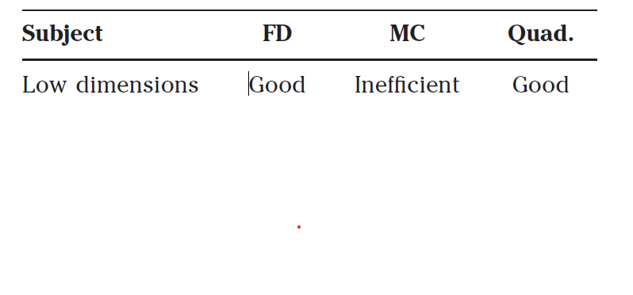

# Numerical Methods

- Monte Carlo
- finite difference - eg binomial methods
- numerical quadrature\
**Quick Summary**

When to use what?
- **Monte Carlo** is  for _complex path dependency_ and _high dimensionality_,
and for problems which cannot easily be written in
differential equation form. 
  - eg. price a fixed-income contract using the
BGM model/LIBOR/swap models.
- **Finite difference** is best for _low dimensions_ and contracts with decision features
such as early exercise, ones which have a differential
equation formulation. 
  - eg. Pricing an option which is paid for in instalments,
and you can stop paying and lose the option
at any time if you think it’s not worth keeping up the
payments. Decision feature - can use finite-difference methods
since it has a decision feature.
- **Numerical quadrature** is for when you can write the option value as a multiple
integral.
  - eg. Pricing a European, non path-dependent contract
on a basket of equities. This may be recast as a
multiple integral and so you would use a quadrature
method.

## Finite Difference Methods

In quantitative finance that differential equation
is almost always of diffusion or parabolic type. The only
real difference between the partial differential equations
are the following: \
• **Number of dimensions** : Atleast two dimensions: S or r, and
t. FD is best for upto 4 dimensions\
• **Functional form of coefficients**: Doesnt make much diff in FD. The main difference between
an equity option problem and a single-factor interest
rate option problem is in the functional form of the
drift rate and the volatility. These appear in the governing
partial differential equations as coefficients\
• **Boundary/final conditions**: in finite-difference schemes in finance we start at expiration
and work towards the present. Boundary conditions
are where we tell the scheme about things like knockout
barriers.\
• **Decision features**: Early exercise, instalment premiums,
chooser features, are all examples of embedded decisions
seen in exotic contracts.\
• **Linear or non-linear:**  Doesnt make much diff in FD. Most are linear.

**Efficiency**: Therefore this is most useful for 
- coping with low dimensions
- contract with embedded decisions
- excellent for non-linear differential equations

**Things to Program**
• **Explicit method/European calls, puts and binaries**:
To get started you should learn the explicit method
as applied to the Black–Scholes equation for a
European option. This is very easy to programme and
you won’t make many mistakes.\
• **Explicit method/American calls, puts and binaries**:
Not much harder is the application of the explicit
method to American options.\
• **Crank–Nicolson/European calls, puts and binaries**:
Once you’ve got the explicit method under your belt
you should learn the Crank–Nicolson implicit method.
This is harder to program, but you will get a better
accuracy.\
• **Crank–Nicolson/American calls, puts and binaries**:
There’s not much more effort involved in pricing
American-style options than in the pricing of
European-style options.\
• **Explicit method/path-dependent options**: By now
you’ll be quite sophisticated and it’s time to price a
path-dependent contract. Start with an Asian option
with discrete sampling, and then try a
continuously-sampled Asian. Finally, try your hand at
lookbacks.\
• **Interest rate products**: Repeat the above programme
for non-path-dependent and then path-dependent
interest rate products. First price caps and floors and
then go on to the index amortizing rate swap.\
• **Two-factor explicit**: To get started on two-factor
problems price a convertible bond using an explicit
method, with both the stock and the spot interest
rate being stochastic.\
• **Two-factor implicit**: The final stage is to implement
the implicit two-factor method as applied to the
convertible bond.\

## Monte Carlo Methods
when pricing you must simulate the risk-neutral random walk(s), the value of a contract is
then the expected present value of all cashflows.

When
implementing a Monte Carlo method look out for the
following:\
• Number of dimensions - time will only be proportional
to number of factors, which isn’t so bad.\
• Functional form of coefficient- not important\
• Boundary/final conditions - similar to FD\
• Decision features - main drawback\
• Linear or non linear- cope poorly with non-linear models

**Things to Program**

• **European calls, puts and binaries on a single equity:**
Simulate a single stock path, the payoff for an option,
or even a portfolio of options, calculate the expected
payoff and present value to price the contract.\
• **Path-dependent option on a single equity:** Price a
barrier, Asian, lookback, etc.\
• **Options on many stocks**: Price a multi-asset contract
by simulating correlated random walks. You’ll see
how time taken varies with number of dimensions.\
• **Interest rate derivatives, spot rate model**: This is not
that much harder than equities. Just remember to
present value along each realized path of rates before
taking the expectation across all paths.\
• **HJM model**: Slightly more ambitious is the HJM
interest rate model. Use a single factor, then two
factors
etc.\
• **BGM model**: A discrete version of HJM.

## Numerical Integration
One can write down the solution of an
option-pricing problem in the form of a multiple integral.\
This is because you can interpret the option value as an
expectation of a payoff, and an expectation of the payoff
is mathematically just the integral of the product of that
payoff function and a probability density function. \
This
is only possible in special cases. \
- The option has to be
European
- the underlying stochastic differential equation
must be explicitly integrable (so the lognormal random
walk is perfect for this) and 
- the payoff shouldn’t usually
be path dependent. 

So if this is possible then pricing is
easy. . . you have a formula. The only difficulty comes
in turning this formula into a number. And that’s the
subject of numerical integration or quadrature. Look out
for the following.
• Can you write down the value of an option as an
integral?