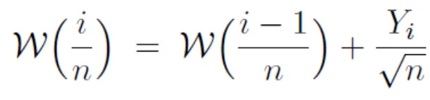

# Brownian Motion

### Contents
1. Brownian motion properties
2. Wiener Process - represents brownian motion

## Brownian motion properties
1. **W(0) = 0** : It means that at time 0, the value of the Brownian motion path is 0
2. **W(t) ~ N(0, t)** : the underlying probability distribution of the Brownian motion over time t is normally distributed -  mean = 0 , variance = t.
3. **W(t) — W(s) ~ N(0, t — s)** : every increment s of Brownian motion is also normally distributed. At time t = 1, the expected value of all of the values is 0. Therefore, if we increment the time from 0 to 1 then the expected value at time 1 will also be 0. The variance is proportional to the time t and is is  time t minus time s
4. **W(t) Has Stationary and Independent Increments**:\
       a. Stationary: unconditional joint probability distribution does not change\
       b. Independent:  at each increment, the expected value is going to be 0 and the variance is going to be the difference between time
5. **Covariance (W(t), W(s)) = Minimum Of t and s** 

6. **Brownian motion is a Markov Process**: the present and future behaviour of a BM does not depend on its past. Hence, how a stock price behaves in the past does not dictate how it will behave in today or in the future

7. **Brownian Motion is Martingale**:  past knowledge is not required to predict the future. the expected value of the next timepoint u given all previous values, is going to be equal to the current expected value of timepoint t
8. **Brownian motion is continuous. It is not differentiable.**:Brownian motion is infinitely irregular to an extent that it cannot be differentiated. It means that the Brownian motion does not have any jumps. Therefore there is no discontinuity in the process. The Brownian motion is not differentiable because its walk is absolutely random
9. **Brownian motion is fractal**: we cannot find the gradient at any point due to its irregular shape.

## Weiner Process

n = total steps in BM\
Yi = maybe basic stochastic process like Random Walk or sample from a Normal distribution\

W(i/n) = current state\
W(i-1/n) = previous state

Links:
- Intro: https://medium.com/fintechexplained/what-is-brownian-motion-36de732b1645
- Python: https://towardsdatascience.com/brownian-motion-with-python-9083ebc46ff0