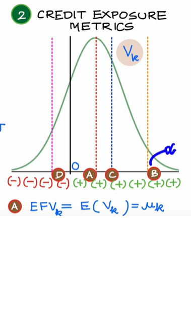
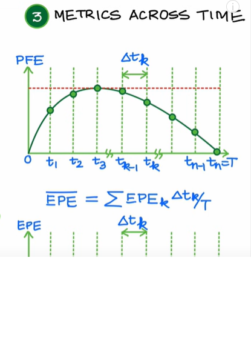

# Credit Risk Models
There are four broad categories of financial risk that most companies must contend with.
- Market risk is what happens when there is a substantial change in the particular marketplace in which a company competes.
- Credit risk is when companies give their customers a line of credit; also, a company's risk of not having enough funds to pay its bills.
- Liquidity risk refers to how easily a company can convert its assets into cash if it needs funds; it also refers to its daily cash flow.
- Operational risks emerge as a result of a company's regular business activities and include fraud, lawsuits, and personnel issues.
### Topics
- Structural v Reduced Form Models
- Hazard Rate / Default Intensity 
- Real World v Risk Neutral Default Probabilities
- Logistic Regression for probability of default
- Recovery Rate and Probability of Default Independence
- Vasichek Model for Credit Risk Capital
- Netting Factor
- xVA : Introduction
- Credit Exposure Metrics
- Credit Exposure Metrics for IRS

**Types**
1. **Structural Model** - why default occurs? default endogenous - option pricing
2. **Reduced Form Model** - when does default occur? default exogenous - statistical models.\
Default intensity - conditional probability of default over a small time period assuming no default upto this point
Better fit to the actual model

### RR

Total loss = exposure_at_defualt * loss_given_defualt * probabiltiy_of_defualt\
             = EAD * LGD * PD\
In reality we cant say that LGD and PD are independent since any collateral of the CPTY we are trying to sell in the event off loss will have a depressed value once the CPTY has defaulted

In merton model is the At(asset exposure) inc then PD incr

### Vasichek Model

### Credit Risk Metrics

Reference : https://www.youtube.com/watch?v=Mq2DCM7OFBw&list=PLLR-zVgpbvsWpQRayMwv40SOWJgfboCqr&index=9&ab_channel=finRGB

exposure = loss assuming zero recovery if counterparty were to default\
CE = current_exposure = max(V(today), 0)\
exposure at t1 = random variable depending on market variables\
There is a tradeoff b/w calculating most accurate exposures and cost of computation
So we take the distribution of each exposure V(t) at each of times t's. let v(k) for distribution(eg normal distribution) at time k

the curve shows the MTM values

let the following metrics describe the 

1. EFV : Expected Future Exposure - the difference between the CE and EFV can exaplin impact of drift of market variables, impact of assymetric collateral arrangements.
2. PFE: Potential Future Exposure - helps setting credit limit - like VAR - under a certain confidence limit of alpha find the exposure that lies beyond this confidence limit
3. EPE : Expected positive exposure - average amount the CPTY would owe if we defualt at a  time t - Input to CVA
4. ENE : Expected positive exposure - average amount  I would owe if I default at a time t - Input to DVA

5. EEE : Effective Expected Exposure:  "Roll Over Risk " causes underestimation of expected exposures. Since risk is going to be rolled over we need to fill in the troughs

Each of these metrics can be studied across time

Find Max PFE based across time and that is then used to set credit limits

